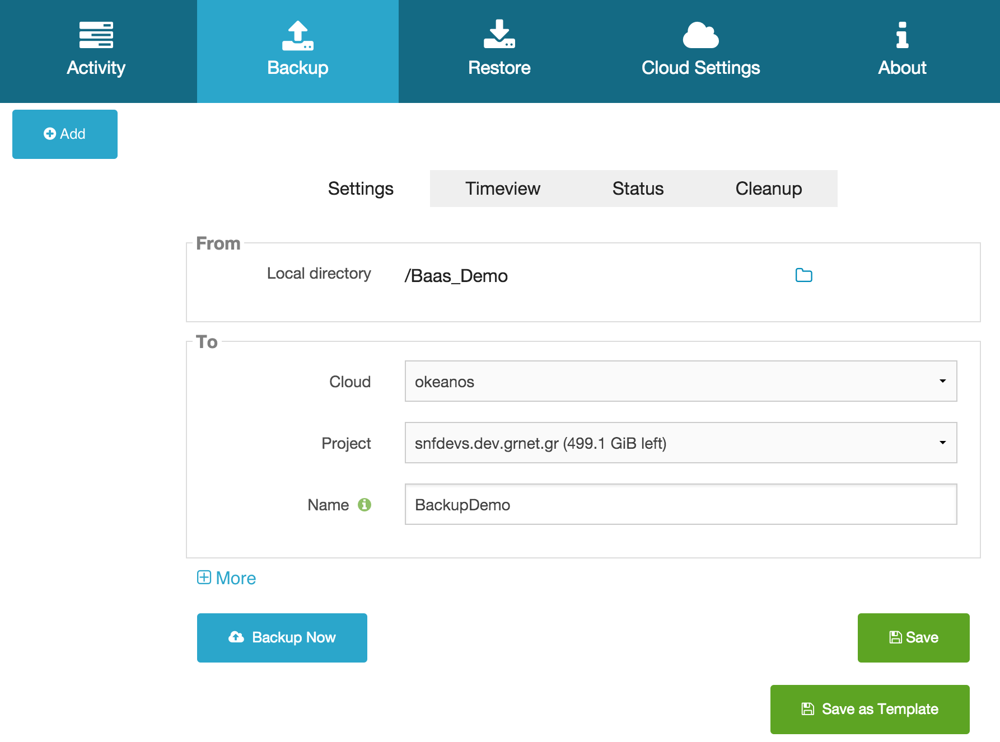
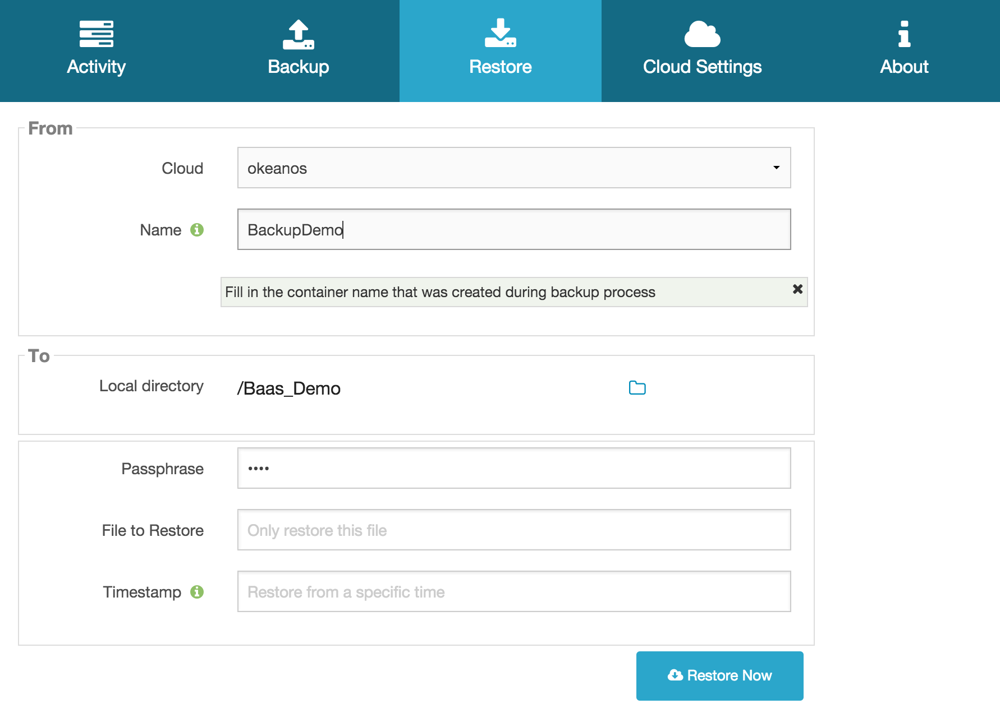
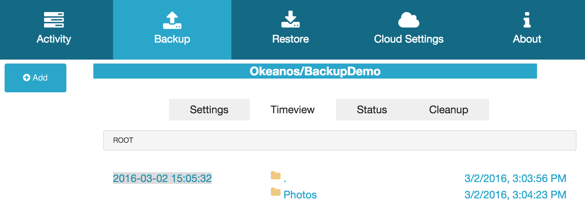
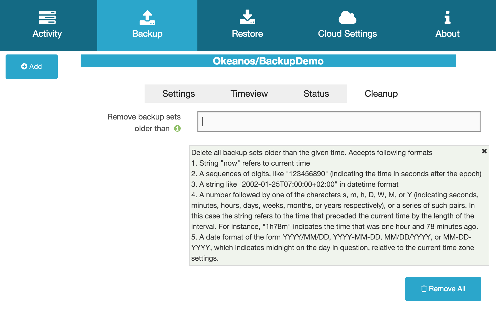
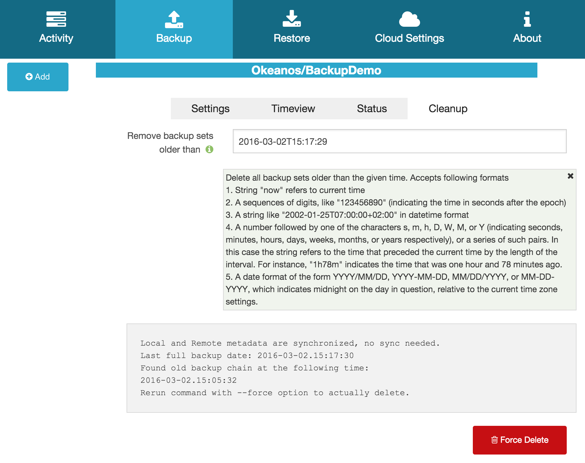

.. _gui:

How to use BaaS
===============

In this section it is assumed BaaS is installed and properly setup.

* For installation instructions, go to :ref:`installation`.
* For setup instructions, go to :ref:`setup`.

Take a Back up
--------------

To create a new Backup set go to ``Backup`` section and click *Add*.
You can provide your own settings or start from an existing template.

You can also provide *Exclude* and *Include* options.

Click on *Save* button to save current settings or *Backup Now* to save settings
and start backup process.

.. note:: Backup name will also appear as a container in your cloud.

When finished you can check *Status* section for detailed information.

``Activity`` section is now updated to display the latest actions:

Restore a Back Up
-----------------

To restore a previously uploaded backup set select it from ``Activity`` section and click
on *Restore* button. You are now in ``Restore`` section:

Click *Restore Now* button to download the whole set.
Fill in *File to Restore* field if you want to restore a single file.
Fill in *Timestamp* field to retrieve an older version of your backup.

.. note:: You can also restore backup sets that weren't uploaded from your current
    workstation as long as you provide cloud and container name (From: Name field) and the
    Passphrase used to encrypt it.

Timeview
--------

You can review backup folders and files under *Timeview* section:

Double-click on folders to review their contents:

By clicking on a file or folder the *Restore* icon appears. Select it to automatically
fill in the corresponding fields in the ``Restore`` section.

Cleanup
-------

You can cleanup older backup sets under *Cleanup* section:

By clicking *Remove All* button a list with old backup sets that will be deleted will appear:

By clicking *Force Delete* button, files will actually get deleted.
